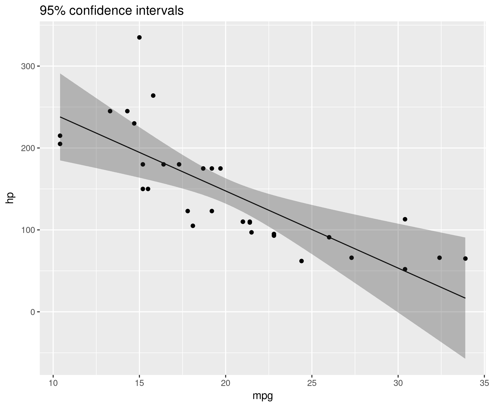
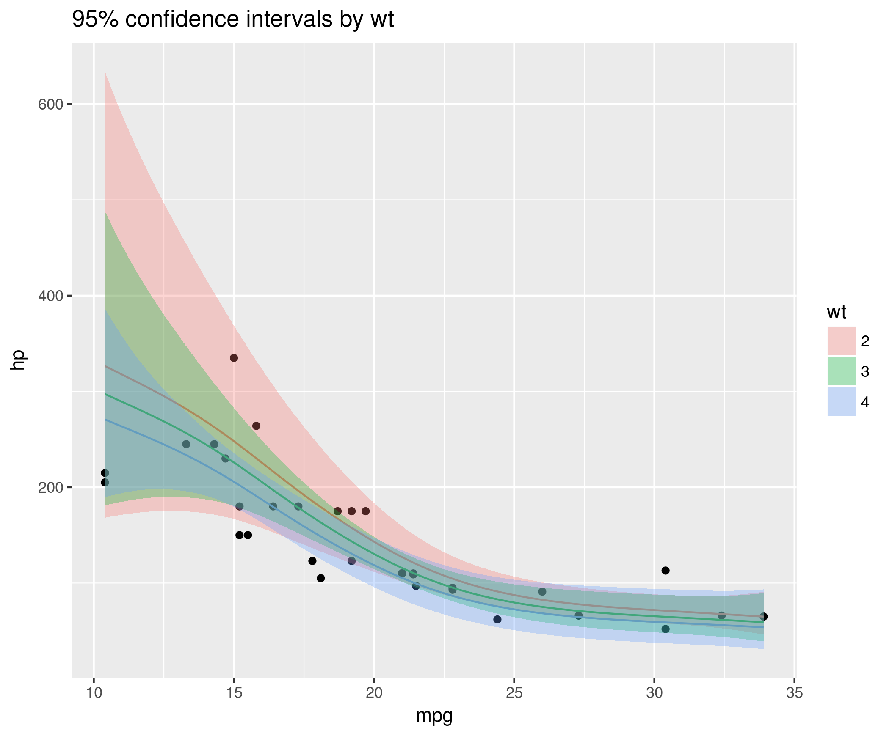
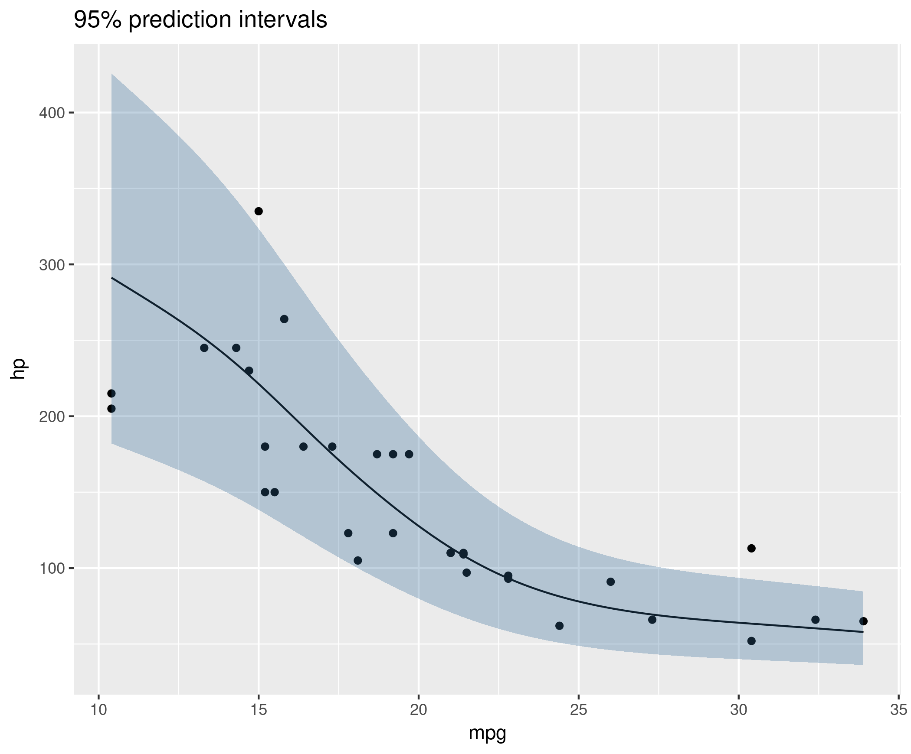

# profilr

Profile predictions given a fitted model.

By profiling, I mean visualizing the results of fitting a model
object: showing predictions and confidence intervals around means and
realizable values.

```r
library(ggplot2)
library(profilr)
fit <- glm(hp ~ mpg + wt, data = mtcars)
ci  <- make_confidence_intervals(fit, newdata = build_mesh(fit))
ggplot(data = ci, mapping = aes(x = mpg, y = fit)) +
  geom_point(data = mtcars, mapping = aes(y = hp)) +
  geom_line() +
  geom_ribbon(mapping = aes(ymin = lwr, ymax = upr),
              alpha = 0.3) +
  labs(title = "95% confidence intervals", y = "hp") -> p
```

<!-- -->

Right now, this package works with basic fits from `lm`, `glm`, and
`gam`. Our goal is to expand this list to support more models.

```r
library(mgcv)
fit <- gam(hp ~ s(mpg) + s(wt),
           family = Gamma(link = log),
	   data = mtcars)
ms  <- build_mesh(fit, x = "mpg", at = list(wt = c(2, 3, 4)))
ci  <- make_confidence_intervals(fit, newdata = ms)
ggplot(data = ci, mapping = aes(x = mpg)) +
  geom_point(data = mtcars, mapping = aes(y = hp), show.legend = FALSE) +
  geom_line(aes(y = fit, color = factor(wt)), show.legend = FALSE) +
  geom_ribbon(mapping = aes(ymin = lwr, ymax = upr, fill = factor(wt)),
              alpha = 0.3) +
  labs(title = "95% confidence intervals by wt",
       fill = "wt", color = "wt")
```

<!-- -->

These last examples show mean predictions. We can also make
predictions on realizable values.

```r
msp  <- build_mesh(fit) # mesh for prediction intervals
pi  <- make_prediction_intervals(fit, newdata = msp)
ggplot(data = pi, mapping = aes(x = mpg, y = fit)) +
  geom_point(data = mtcars, mapping = aes(y = hp)) +
  geom_line() +
  geom_ribbon(mapping = aes(ymin = lwr, ymax = upr, fill = wt),
              alpha = 0.3, show.legend = FALSE) +
  labs(title = "95% prediction intervals", y = "hp")
```

<!-- -->


